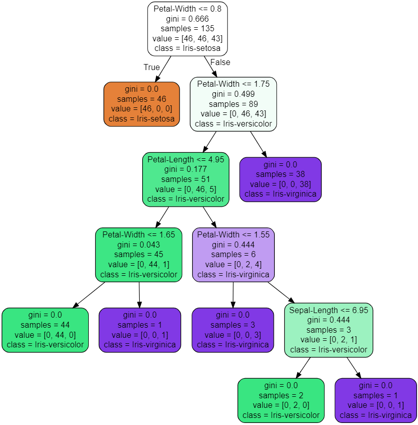

# Iris Classification
Dabbling with Machine Learning in Python using the Iris Flower Dataset

## Final Result
- Here is a visualization of a sample decision tree created via the program

### Motivation
- I created this project in December 2020. After learning about decision trees, 
the ID3 algorithm and machine learning in general while in school, I decided to 
learn how to use Python for its machine learning applications through this video 
by [Programming with Mosh](https://www.youtube.com/watch?v=7eh4d6sabA0).

## Getting Started

### Prerequisites
- Make sure to install the pandas library, which can be done via `pip install pandas`,
the scikit-learn library, which can be done via `pip install sklearn`, and the joblib library,
which can be done via `pip install joblib`.

- The dataset from which the model was trained is included in the files, but it was collected from the [UCI Machine Learning Repository](https://archive.ics.uci.edu/ml/datasets/iris)

### Running the Classifier
- All that is required to run this classifier is to open up a terminal window and 
type `print(flower_model.predict([[int,int,int,int]]))` where each of the respective
`int` values represent the sepal-length, sepal-width, petal-length and petal-width respectively.

- As for running a similar classifier for your own projects, the video by Programming with Mosh linked above is extremely helpful

### Authors
- I developed this piece of software by myself, with the aid of youtube tutorials

### License
- This project is licensed through the MIT License

### Learning Process
- Although I was aware of the concepts of decision trees and machine learning as I had studied these in school, 
I learned the industry applications and variations of these methods. 

### Acknowledgements
- Thanks to [Mosh Hamedani](https://www.youtube.com/user/programmingwithmosh) for his tutorial on Machine Learning in Python